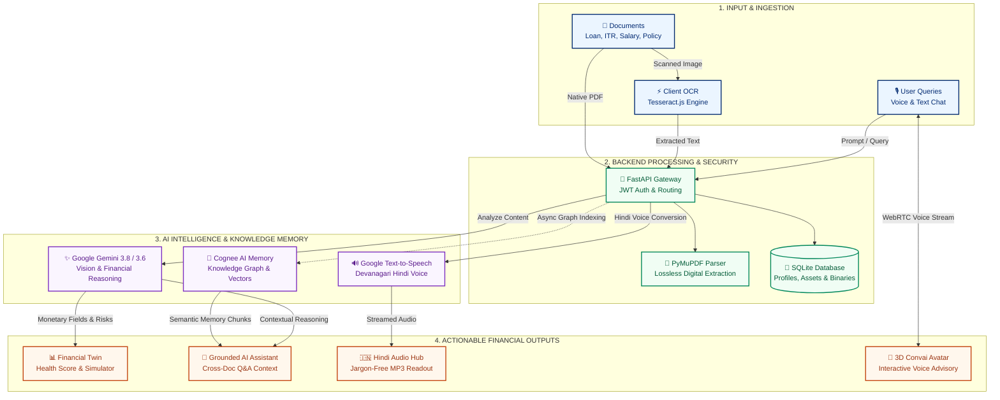
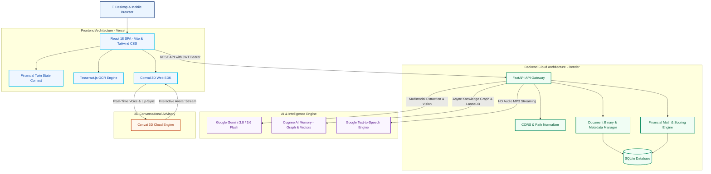

# 🔍 FinLens AI — Personal AI Financial Command Centre

> **Demystify financial documents in English and Hindi, maintain an evolving AI Financial Memory across documents with Cognee, simulate life events with your Financial Twin, and consult with an interactive 3D conversational advisor.**

[](https://fin-lens-jyy5.vercel.app)
[](https://finlens-1-7sf7.onrender.com)
[](https://fastapi.tiangolo.com)
[](https://reactjs.org)
[](https://ai.google.dev)
[](https://www.cognee.ai)
[](https://convai.com)

---

## 🌐 Live Deployments & Demo Access

| Service | URL | Notes |
| :--- | :--- | :--- |
| **Official Website** | [https://www.arvronline.in](https://www.arvronline.in) | Production custom domain with full SSL |
| **Vercel Production App** | [https://fin-lens-jyy5.vercel.app](https://fin-lens-jyy5.vercel.app) | Responsive React 18 SPA frontend |
| **Render Cloud Backend** | [https://finlens-1-7sf7.onrender.com](https://finlens-1-7sf7.onrender.com) | FastAPI cloud microservice |
| **Interactive API Docs** | [https://finlens-1-7sf7.onrender.com/docs](https://finlens-1-7sf7.onrender.com/docs) | Swagger UI for exploring live endpoints |

### 🔑 Pre-Configured Demo Account
Experience FinLens AI instantly without creating an account:
- **Email:** `demo@finlens.ai`
- **Password:** `123456`
- **Preloaded Profile:** Rahul Sharma (Salaried IT Professional, Monthly Income: ₹70,833, Expenses: ₹32,000, Existing EMIs: ₹14,000, Savings: ₹2,50,000)

---

## ✨ Key Features

### 1. 📄 Multilingual Financial Document Intelligence & Vision OCR
- **Multi-Document Support:** Upload and analyze **Loan Agreements**, **Income Tax Returns (ITR)**, **Salary Slips**, **Bank Statements**, **Insurance Policies**, **Investment Statements**, and **Credit Reports**.
- **Hybrid Multi-Stage Extraction Pipeline:**
  - **PyMuPDF Engine:** Extracts digital text layers rapidly and losslessly from native PDF files on the backend.
  - **Client-Side Tesseract.js OCR:** Performs local optical character recognition in the browser for image uploads, minimizing bandwidth and latency.
  - **Gemini Multimodal Vision:** Directly processes scanned, photographed, or complex graphical documents when OCR text is sparse or noisy.
- **Deep Structured Breakdown:** Automatically extracts key monetary figures (EMIs, tenures, interest rates, processing charges, tax deductions, sums assured), produces an executive summary, and flags hidden fees or restrictive clauses.

### 2. 🧠 Cognee AI Financial Memory & Knowledge Graph
- **Cross-Document Relationship Retrieval:** FinLens connects isolated financial records into a persistent, unified knowledge base powered by **Cognee**. Ask questions that span multiple documents (e.g., *"Does my monthly salary cover my existing loan EMIs and credit card debits?"*).
- **Isolated User Datasets:** Every user receives an isolated semantic dataset (`user_{id}_financial_memory`), ensuring strict multi-tenant privacy.
- **Dual Operational Modes:**
  - **Local Mode (Default):** Runs an embedded local stack (LanceDB for vector embeddings, Ladybug local graph store, SQLite metadata) reusing the existing `GEMINI_API_KEY` for LLM and embedding calls via LiteLLM. No external database accounts required.
  - **Cloud Mode:** Plugs into a managed Cognee Cloud tenant (`COGNEE_MODE=cloud`) via REST client for serverless graph ingestion.
- **Asynchronous Background Ingestion:** Analyzed documents trigger non-blocking background indexing (`cognify`) so UI interactions remain instantaneous.

### 3. 📂 Document History & Lifecycle Management
- **Comprehensive Document Hub:** Access and filter all previously uploaded documents by category (Loan, Insurance, ITR, Salary Slip, Bank Statement, etc.).
- **Live Memory & Analysis Badges:** Monitor ingestion states in real time (`In financial memory`, `Adding to memory...`, `Memory unavailable`, or `Memory disabled`).
- **One-Click Actions:**
  - **Direct AI Chat:** Jump straight into the AI Assistant with preloaded document context.
  - **Re-Analyze:** Re-run analysis against newly selected Gemini models.
  - **Secure Download & Preview:** Retrieve original uploaded binary files.
  - **Safe Deletion:** Remove documents with automatic balance unwinding from the user's Financial Twin.

### 4. 🇮🇳 हिंदी में समझें और सुनें (Hindi Document Simplification & HD Voice Readout)
- **Plain Devanagari Hindi Simplification:** Automatically translates dense banking, legal, and insurance jargon into conversational, easy-to-understand Devanagari Hindi.
- **Server-Side Google Text-to-Speech (gTTS):** High-definition voice audio streaming (`POST /api/speech/tts`) delivered straight to the browser as an MP3 stream.
- **Universal Cross-Platform Playback:** Guarantees flawless Hindi audio pronunciation across Windows, macOS, Linux, iOS, and Android—completely eliminating issues with missing OS-level Hindi voice packages.

### 5. 📊 Dynamic Financial Twin & Health Score
- **Holistic Financial Modeling:** Aggregates income, non-discretionary expenses, existing loan EMIs, insurance premiums, investments, and liquid savings into a dynamic **Financial Health Score** (0–100).
- **Core Ratio Telemetry:**
  - **Monthly Disposable Surplus:** Computes net cash buffer after all obligations.
  - **Debt-to-Income (DTI) Ratio:** Gauges borrowing risk against conservative lending benchmarks (<35% Healthy, 35–50% Moderate, >50% Critical).
  - **Savings Rate & Emergency Fund Runway:** Evaluates monthly savings velocity and months of emergency expenses covered.
- **One-Click Profile Sync:** Directly sync analyzed loan EMIs or insurance premiums into your active profile.

### 6. 🔮 What-If Life Scenario Simulator
- **Interactive Financial Sandbox:** Test major financial commitments before signing agreements.
- **Simulate Real-World Scenarios:**
  - Taking a new Home Loan, Car Loan, or Personal Loan (custom principal, interest rate, and tenure).
  - Experiencing a salary hike or income reduction.
  - Unplanned emergency expenses (e.g., medical emergencies or urgent repairs).
  - Adjusting monthly SIP or mutual fund contributions.
- **Instant Impact Feedback:** Real-time visual recalculation of resulting DTI, revised monthly surplus, and updated Financial Health Score.

### 7. 👤 3D Conversational Avatar Advisor (Convai) & AI Chatbot
- **Live 3D AI Financial Advisor:** Engage in voice-first interactive financial consultations with a responsive 3D avatar powered by **Convai Web SDK**.
- **Dynamic Character Configuration:** Easily switch or customize Convai Character / Experience IDs on the fly in the UI without redeploying code.
- **AI Financial Assistant:** Multilingual chatbot powered by Google Gemini with strict guardrail prompts, contextual profile awareness, and Cognee cross-document memory retrieval.

### 8. ⚡ Multi-Model Gemini Engine (Gemini 3.8 / 3.6 / 3.5)
- **Selectable Intelligence Tier:** Switch dynamically between Gemini models directly from the header dropdown:
  - `gemini-3.8-flash`: Highest reasoning fidelity for intricate tax and legal documents.
  - `gemini-3.6-flash`: Recommended default offering optimal balance of speed and analytical depth.
  - `gemini-3.5-flash`: Fast, robust everyday performance.
  - `gemini-3.5-flash-lite`: Low-latency, cost-efficient analysis.
- **Resilient Fallback Mechanism:** Graceful degradation ensures document text extraction remains functional even if AI services encounter rate limits.

---

## 🔄 End-to-End System Workflow

The following sequence details how FinLens processes user inputs, documents, AI reasoning, and interactive advisory sessions:



### Detailed Workflow Stages

```text
┌────────────────────────────────────────────────────────────────────────────────────────┐
│ STAGE 1: INGESTION & OCR                                                               │
│ User selects a file (PDF / PNG / JPG)                                                 │
│  ├─ PDF: Streamed to FastAPI -> PyMuPDF parses digital text layer                      │
│  └─ Image: Frontend executes Tesseract.js -> Pre-extracted text passed with binary    │
│ Both original binary and raw text are securely stored in SQLite.                       │
└────────────────────────────────────────────────────────────────────────────────────────┘
                                           │
                                           ▼
┌────────────────────────────────────────────────────────────────────────────────────────┐
│ STAGE 2: MULTIMODAL EXTRACTION & RISK AUDITING                                         │
│ FastAPI invokes Google Gemini (3.8 / 3.6 Flash):                                       │
│  ├─ Parses exact financial figures (loan amount, interest rate, tenure, EMI, charges)   │
│  ├─ Generates an executive summary in plain English                                    │
│  └─ Flags adverse clauses (prepayment penalties, foreclosure fees, default interest)   │
└────────────────────────────────────────────────────────────────────────────────────────┘
                                           │
                                           ▼
┌────────────────────────────────────────────────────────────────────────────────────────┐
│ STAGE 3: COGNEE AI MEMORY SYNCHRONIZATION                                              │
│ FastAPI dispatches an asynchronous background task:                                    │
│  ├─ Chunks document summary, structured fields, and extracted text                     │
│  ├─ Ingests into user's isolated Cognee dataset (user_{id}_financial_memory)           │
│  └─ Cognifies entities into semantic knowledge graph & LanceDB vector representations  │
│  Document badge transitions from "Adding to memory..." -> "In financial memory".       │
└────────────────────────────────────────────────────────────────────────────────────────┘
                                           │
                                           ▼
┌────────────────────────────────────────────────────────────────────────────────────────┐
│ STAGE 4: HINDI CONVERSION & HD AUDIO STREAMING                                         │
│  ├─ Gemini translates jargon into conversational Devanagari Hindi                      │
│  ├─ Google TTS converts Devanagari text into crystal-clear MP3 stream                  │
│  └─ Audio streams directly to browser, bypassing missing client-side voice packs       │
└────────────────────────────────────────────────────────────────────────────────────────┘
                                           │
                                           ▼
┌────────────────────────────────────────────────────────────────────────────────────────┐
│ STAGE 5: FINANCIAL TWIN RECALCULATION & SIMULATION                                     │
│  ├─ One-click sync saves loan/insurance to profile database                            │
│  ├─ Mathematical engine updates Debt-to-Income (DTI), Surplus, and Health Score (0-100)│
│  └─ User simulates life events in What-If Sandbox (salary change, new EMI, emergencies)│
└────────────────────────────────────────────────────────────────────────────────────────┘
                                           │
                                           ▼
┌────────────────────────────────────────────────────────────────────────────────────────┐
│ STAGE 6: CROSS-DOCUMENT AI ADVISORY & 3D CONVAI CONSULTATION                           │
│  ├─ Chat Assistant queries Cognee for relevant cross-document context chunks           │
│  ├─ Gemini synthesizes contextual advice combining Profile + Cognee Memory + Query     │
│  └─ 3D Convai Avatar provides hands-free voice consultation with real-time lip-sync    │
└────────────────────────────────────────────────────────────────────────────────────────┘
```

---

## 🏛️ System Architecture



---

## 📁 Repository Structure

```text
FinLens/
├── backend/
│   ├── data/                           # SQLite database & demo seed data
│   │   ├── finlens.db                  # Local relational database
│   │   └── cognee_storage/             # Local Cognee LanceDB & graph data
│   ├── models/
│   │   ├── db.py                       # SQLAlchemy models & engine definitions
│   │   └── schemas.py                  # Pydantic request/response schemas
│   ├── routes/
│   │   ├── assistant.py                # AI Chat with Cognee memory injection
│   │   ├── auth.py                     # User authentication & demo seed
│   │   ├── cognee.py                   # Cognee memory inspection & search
│   │   ├── documents.py                # Upload, analysis, download, Hindi breakdown
│   │   ├── finance.py                  # EMI calculations & Health Score engine
│   │   ├── profile.py                  # Financial Twin profile & asset records
│   │   └── speech.py                   # Google TTS MP3 streaming endpoint
│   ├── services/
│   │   ├── cognee_service.py           # Cognee vector + graph integration layer
│   │   ├── finance_calculations.py     # Deterministic DTI & health scoring math
│   │   ├── finance_extraction_service.py # Structured Gemini extraction & prompts
│   │   ├── gemini_service.py           # Gemini SDK wrapper & model resolver
│   │   ├── image_service.py            # Image preprocessing utilities
│   │   ├── pdf_service.py              # PyMuPDF native PDF parser
│   │   └── security.py                 # JWT token generation & hashing
│   ├── config.py                       # Pydantic Settings & CORS resolution
│   ├── main.py                         # FastAPI application entry point
│   ├── requirements.txt                # Python dependencies
│   ├── Dockerfile                      # Backend container configuration
│   └── .env.example                    # Backend environment configuration template
├── frontend/
│   ├── src/
│   │   ├── components/
│   │   │   ├── DocumentHistory.jsx     # Document repository & status manager
│   │   │   ├── Header.jsx              # Navigation, Gemini model selector, language toggle
│   │   │   └── SpeechControls.jsx      # Audio readout player controls
│   │   ├── constants/
│   │   │   └── documentTypes.js        # Document type definitions & labels
│   │   ├── context/
│   │   │   └── FinancialTwinContext.jsx# Reactive financial profile state store
│   │   ├── pages/
│   │   │   ├── Assistant.jsx           # AI Financial Chatbot (Gemini + Cognee)
│   │   │   ├── ConvaiAdvisor.jsx       # 3D Avatar Advisor with dynamic character ID
│   │   │   ├── Dashboard.jsx           # Command center financial overview
│   │   │   ├── Documents.jsx           # Document upload, analysis & Hindi readout
│   │   │   ├── FinancialTwin.jsx       # Financial Twin profile & balance sheets
│   │   │   ├── HealthScore.jsx         # Health score metrics & telemetry breakdown
│   │   │   ├── Insights.jsx            # Actionable spending & saving recommendations
│   │   │   ├── Login.jsx               # Authentication & demo account access
│   │   │   ├── Products.jsx            # Eligible loans & insurance recommendations
│   │   │   ├── Settings.jsx            # User preferences & Convai setup
│   │   │   ├── Simulator.jsx           # What-If life scenario sandbox
│   │   │   └── Transactions.jsx        # Income & expenditure log
│   │   ├── services/
│   │   │   ├── apiService.js           # Base HTTP client with JWT interceptor
│   │   │   ├── financeService.js       # Documents, profile & calculation endpoints
│   │   │   └── geminiModels.js         # Supported Gemini model constants
│   │   ├── App.jsx                     # Route definitions & layout wrappers
│   │   └── main.jsx                    # React 18 DOM mount point
│   ├── package.json                    # Frontend dependencies & Vite scripts
│   ├── tailwind.config.js              # Custom FinLens UI design tokens
│   ├── vercel.json                     # Vercel SPA rewrite configuration
│   └── .env.example                    # Frontend environment configuration template
├── docker-compose.yml                  # Multi-container orchestration
├── render.yaml                         # Render Cloud Infrastructure Blueprint
├── DEPLOYMENT.md                       # Comprehensive deployment manual
└── README.md                           # Master project documentation
```

---

## 📡 API Reference

All routes are mounted under the `/api` prefix on the backend server:

| Group | Method | Path | Description |
| :--- | :---: | :--- | :--- |
| **Auth** | `POST` | `/api/auth/register` | Create a new user account |
| | `POST` | `/api/auth/login` | Authenticate and obtain JWT Bearer token |
| | `GET` | `/api/auth/me` | Fetch authenticated user information |
| **Documents** | `POST` | `/api/documents/upload` | Stage 1: Upload document and extract text via PyMuPDF/OCR |
| | `POST` | `/api/documents/analyze` | Stage 2: Run Gemini multimodal extraction & trigger Cognee sync |
| | `GET` | `/api/documents` | Retrieve list of uploaded documents with memory status |
| | `GET` | `/api/documents/{id}` | Fetch detailed extraction, summary, fields, and risks |
| | `GET` | `/api/documents/{id}/download` | Download original uploaded document binary |
| | `DELETE` | `/api/documents/{id}` | Delete document and unwind associated Financial Twin balances |
| | `POST` | `/api/documents/{id}/hindi-explanation` | Generate Devanagari Hindi simplification & spoken script |
| **Memory** | `POST` | `/api/cognee/search` | Query user's isolated Cognee financial memory chunks |
| **Profile** | `GET` | `/api/profile/{user_id}` | Fetch Financial Twin profile, active loans, and policies |
| | `PATCH` | `/api/profile/{user_id}` | Update income, expenses, savings, or credit score |
| | `POST` | `/api/profile/{user_id}/assets/loan` | Save an analyzed loan directly to Financial Twin |
| | `POST` | `/api/profile/{user_id}/assets/insurance` | Save an analyzed insurance policy to Financial Twin |
| **Finance** | `POST` | `/api/finance/emi` | Calculate EMI, total interest, and DTI affordability |
| | `POST` | `/api/finance/health-score` | Compute overall 0–100 Financial Health Score breakdown |
| **Assistant** | `POST` | `/api/assistant/chat` | AI conversation grounded by User Profile + Cognee Memory |
| **Speech** | `POST` | `/api/speech/tts` | Synthesize native Hindi/English speech MP3 stream |

---

## 💻 Local Development Setup

### Prerequisites
- **Python 3.11+** installed
- **Node.js 18+** and **npm** installed
- A **Google Gemini API Key** from [Google AI Studio](https://aistudio.google.com/)

---

### Step 1: Backend Setup

```bash
# 1. Navigate to the backend directory
cd backend

# 2. Create and activate a Python virtual environment
python -m venv venv

# Windows PowerShell:
.\venv\Scripts\Activate.ps1
# macOS / Linux:
source venv/bin/activate

# 3. Install backend dependencies
pip install -r requirements.txt

# 4. Configure environment variables
cp .env.example .env
# Open .env and insert your GEMINI_API_KEY

# 5. Launch the FastAPI server with auto-reload
uvicorn main:app --reload --port 8000
```
- **Backend API:** `http://localhost:8000`
- **Interactive Swagger Docs:** `http://localhost:8000/docs`

---

### Step 2: Frontend Setup

```bash
# 1. Open a new terminal and navigate to the frontend directory
cd frontend

# 2. Install dependencies
npm install

# 3. Configure environment variables
cp .env.example .env

# 4. Start the Vite development server
npm run dev
```
- **Frontend Application:** `http://localhost:5173`

---

## ⚙️ Environment Variables Reference

### Backend (`backend/.env`)

| Variable | Required | Default | Description |
| :--- | :---: | :--- | :--- |
| `GEMINI_API_KEY` | **Yes** | — | Google Gemini API Key from Google AI Studio |
| `GEMINI_MODEL` | No | `gemini-3.6-flash` | Default Gemini model (`gemini-3.8-flash`, `gemini-3.6-flash`, etc.) |
| `FRONTEND_URL` | No | `http://localhost:5173` | Comma-separated allowed origins for CORS |
| `COGNEE_ENABLED` | No | `true` | Enable or disable Cognee AI financial memory |
| `COGNEE_MODE` | No | `local` | `local` (embedded LanceDB + Graph) or `cloud` (Cognee Cloud tenant) |
| `COGNEE_CLOUD_URL` | No | — | Required only if `COGNEE_MODE=cloud` (e.g. `https://tenant.aws.cognee.ai`) |
| `COGNEE_API_KEY` | No | — | Required only if `COGNEE_MODE=cloud` |
| `COGNEE_LLM_PROVIDER` | No | `gemini` | LLM provider for Cognee (`gemini`) |
| `COGNEE_LLM_MODEL` | No | `gemini-3.5-flash-lite` | LLM model for Cognee cognify operations |
| `COGNEE_EMBEDDING_PROVIDER` | No | `gemini` | Embedding provider for Cognee (`gemini`) |
| `COGNEE_EMBEDDING_MODEL` | No | `gemini-embedding-001` | Embedding model for semantic vector search |
| `COGNEE_EMBEDDING_DIMENSIONS` | No | `3072` | Embedding vector dimensions |
| `COGNEE_DATA_PATH` | No | `data/cognee_storage` | Local directory for Cognee vector and graph storage |

### Frontend (`frontend/.env`)

| Variable | Required | Default | Description |
| :--- | :---: | :--- | :--- |
| `VITE_API_BASE_URL` | No | `http://localhost:8000` | Backend API URL (e.g. `https://finlens-1-7sf7.onrender.com`) |
| `VITE_CONVAI_EXPERIENCE_ID` | No | — | Default Convai 3D avatar Experience ID *(can also be configured in the UI)* |

---

## 🚀 Cloud Deployment

### Frontend Deployment (Vercel)
1. Import your repository into [Vercel](https://vercel.com).
2. Set **Root Directory** to `frontend`.
3. Set **Framework Preset** to `Vite`.
4. Configure Environment Variable:
   - `VITE_API_BASE_URL` = `https://finlens-1-7sf7.onrender.com`
5. Click **Deploy**. SPA rewrites are handled automatically via `frontend/vercel.json`.

### Backend Deployment (Render)
1. Create a new **Web Service** on [Render](https://render.com).
2. Select your repository and set **Root Directory** to `backend`.
3. Set **Build Command:** `pip install -r requirements.txt`.
4. Set **Start Command:** `uvicorn main:app --host 0.0.0.0 --port $PORT`.
5. Configure Environment Variables:
   - `GEMINI_API_KEY` = `<your_api_key>`
   - `PYTHON_VERSION` = `3.11.9`
   - `FRONTEND_URL` = `https://www.arvronline.in,https://fin-lens-jyy5.vercel.app`

### Custom Domain Configuration (GoDaddy DNS)
- **A Record:** `@` ➔ `76.76.21.21` (Vercel)
- **CNAME Record:** `www` ➔ `cname.vercel-dns.com` (Vercel)
- Remove any existing HTTP Forwarding rules in your DNS provider so root and subdomains route cleanly to Vercel with automatic SSL.

---

## 🛡️ Security & Privacy Architecture

- **Per-User Data Isolation:** Every user's documents, profile data, and Cognee knowledge graph memory are strictly isolated by unique user UUIDs. Users cannot access or query other accounts' financial data.
- **Server-Side Key Isolation:** All third-party credentials (`GEMINI_API_KEY`, `COGNEE_API_KEY`) remain securely on the backend server and are never exposed to client-side code.
- **Controlled Unwinding:** Deleting a document removes its binary and parsed records, and automatically unwinds any recurring liabilities (such as loan EMIs or insurance premiums) that were linked to the user's Financial Twin.
- **Educational Guidance Disclaimer:** *FinLens AI provides educational financial analysis, mathematical projections, and AI-driven document interpretations for informational purposes only. It does not constitute certified legal, tax, or financial advice.*